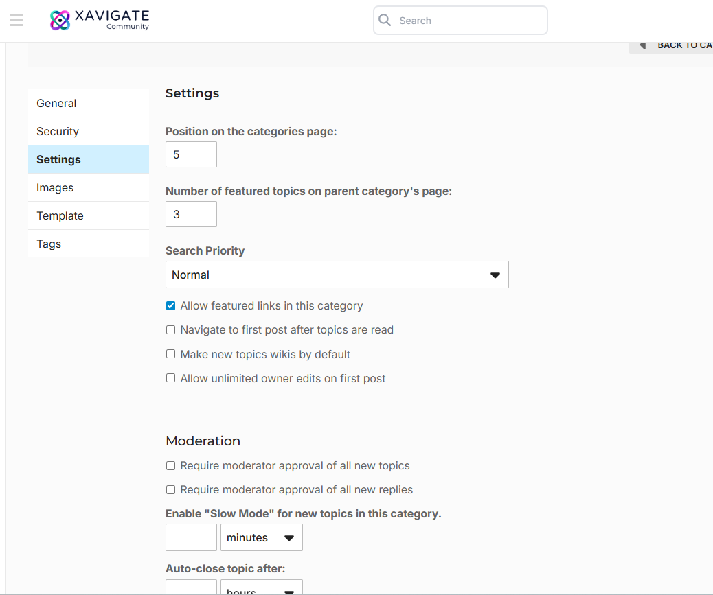
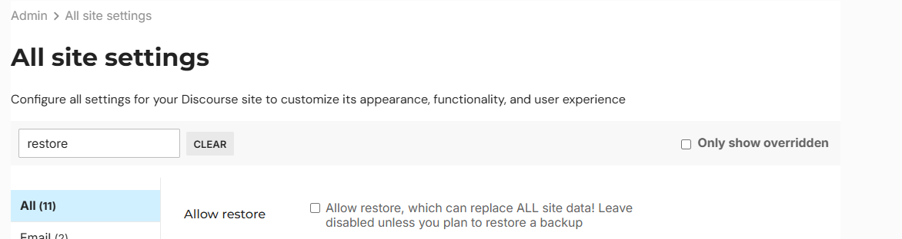
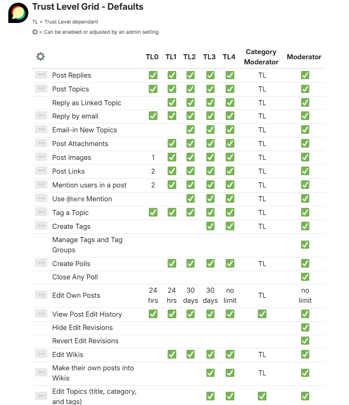
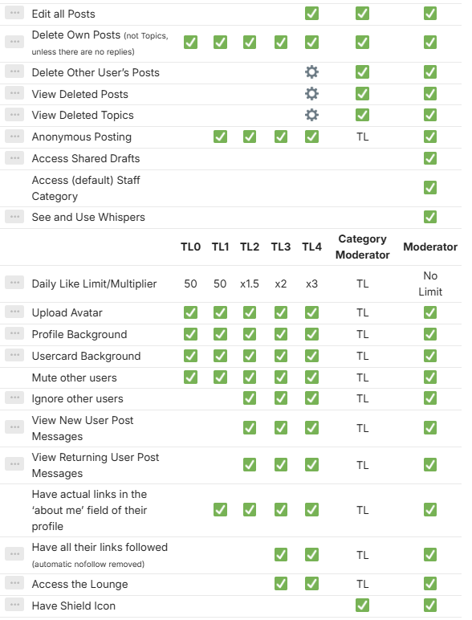
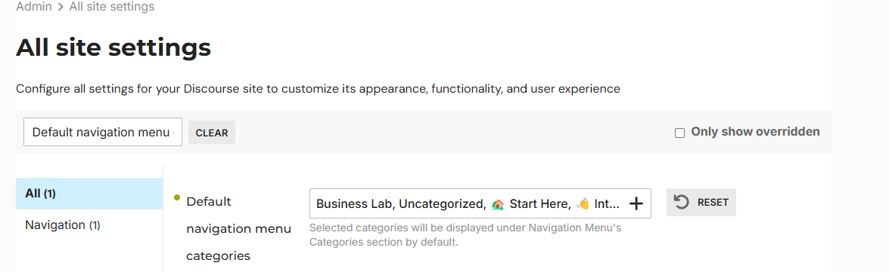

# XAVIGATE Discourse Theme - Client Documentation

Welcome! This document explains, in simple terms, how this Discourse theme works, where the code is located, and how each part contributes to your forum's design and features.

# 🛠 How to Customize Settings in Discourse

Go to your Discourse admin panel.Visit the theme settings page: https://community.example.com/admin/customize/themes/ select the theme . Scroll down to see all the toggle options like "show likes", "card height", etc. Change settings and click Save — changes apply immediately.

# 📝 How to Edit the Code

# 1. Open this theme repository on GitHub
Ask your developer (or you) to make edits to files like mobile, desktop depending on what you want to change.

# 2. Commit changes on GitHub
After editing any file, click Commit changes (green button) on GitHub to save the update.

# 3. Update the theme in Discourse
Go to: https://community.xavigate.com/admin/customize/themes/17 . Click the “Update from Git” button near the top.Discourse will pull the latest version of your theme and apply it instantly.

# Project Structure Overview

# ✅ common/
Shared code that applies to both desktop and mobile views.

# ✅ desktop/
Contains styles, templates, or JS specific to desktop devices.

# ✅ mobile/
Like desktop/, but only for mobile devices.

# ✅ assets/
Used for images, logos, icons, or custom SVGs used in the theme.

# ✅ javascripts/discourse/
Custom JavaScript code that interacts with Discourse components.

# How to setup custom Groups or Spaces

 1. Go to https://community.xavigate.com/g as admin and click on new group
 2. Add the details and add owners and members click create 
 3. To add this group to a category go inside the category and click on wrench icon
  

4. Go to secuirty and add the group created and staff to that group remove all others , to make it private to that group only 

video tutorial for refrence 
[Download Video (MP4)](Spaces%20xavigate.mp4)

# How to create a Category 
1. go to https://community.xavigate.com/categories?safe_mode=no_themes%2Cno_plugins and click on wrench icon 

2. Click on new category and add details 

# How to Create permissions on any CAtegory

1. Go to https://community.xavigate.com/categories?safe_mode=no_themes%2Cno_plugins and click on wrench icon click settings and update the permissions as needed 
2. In settings you can setup categories position and some basic settings for the particular categories
3. In Tags section you can add tags to list the topics with tagging 

# Moderator roles
https://meta.discourse.org/t/trust-level-permissions-reference/224824

Discourse has many built-in user statuses, roles, and permissions.These statuses and roles can be seen for a given user when viewing their profile from the users’ section of the admin dashboard:

### Permission Status - Activated- Account has a verified email and is therefore active in the Discourse instance
Account may login to Discourse, inactive accounts may not login
Inactive accounts can only verify their email (and other routes as necessary to complete registration).
Storage: active boolean column in the users table

### Staged
A special placeholder account which is created automatically by the system for email integration
No email digests are ever sent
Automatically watches all messages it participates in and receives notifications of replies
May reply via email to notifications
Username and Name are automatically picked
Account may still register with the same email and “take over” the staged account.
Forgot password will do nothing …when you attempt to send a password reset to a staged account
Storage: staged field in users table

### Admin
Admin users are the superusers in the system, they can:
Impersonate non-admins
Change site settings
Create groups
Amend site customizations
Perform all the actions moderators can perform
Read any personal message
Create, delete and modify categories
Ignore category permissions to view private categories
Storage: The boolean field admin in the users table flags any admin accounts.

### Moderator
Power-user capable of moderating the site:
Gets shield icon next to name on posts
Can perform all actions Staff can perform
Storage: the boolean field moderator in the users table

### Staff
A staff user is any user that is either an admin or a moderator (or both).
Immune to rate limits
Can process flags and posts held in the moderation queue
Can delete topics and posts, split topics, merge topics, hide topics and so on.
Can view user info (Excluding emails for moderators)
Can suspend, silence, anonymize and delete users
Can adjust a user’s trust level
Storage: computed from the admin and moderator columns on the users table

### Category Moderator
This is a non-staff user who is part of a group that has been granted select moderation powers over specific categories. This can be enabled per site using the enable category group moderation admin setting, and set for each category in the Settings tab of the category wrench:

### Trust level 0 - 4
See: What do user trust levels do?

### Suspended
Account suspended from Discourse instance
A note is displayed on the user page denoting suspension reason
Login is not allowed
Account can only be mentioned by staff
No emails are sent to the user for any notifications (digest, message and so on)
As an exception, any emails initiated by staff are still sent to the user
Storage: suspended_till datetime column in users table

### Silenced
Either manually by staff or when an account is flagged by spam system as a problem account, all posting is disabled.
Account may not reply to any topic
Account may not create any topics
Account may not create PMs, but can reply to PMs
Account may not create flags
Account still can like and bookmark
Account can still change user prefs and about me (TBD if this is a good idea)
Mailing list mode stops working
Storage: silenced boolean column in the users table

### Other Status
Users can have a few additional statuses not shown in the permissions section of the admin dashboard.

### New user
Special restricted account for the first day of usage or new accounts. new_users have special rate limits defined in site settings

### Trust Level 1 account created in the last 24 hours, or Trust Level 0
Non-staff account
Limits:
Can only create a topic once every 2 minutes (rate_limit_new_user_create_topic)
Can only create a post once every 30 seconds (rate_limit_new_user_create_post)
Storage: computed from created_at, moderator, admin, and trust_level columns on the users table

### First day user
Special additional restrictions that apply to an account created in the last 24 hours

### Account created in the last 24 hours
Non staff account
Not TL2 or above
Limits:
May only create 10 replies (max_replies_in_first_day)
May only create 3 topics (max_topics_in_first_day)
Storage: computed from created_at, moderator, admin, and trust_level columns on the users table

## Approved
If the site setting must_approve_users is enabled a user must be approved prior to being allowed to log in.

# SSH to server / Backend commands
1. Log in to server with any application you prefer like Putty or Winscp , enter server IP and use key to login
2. Discourse is in /var/discourse and user is root 
3. To add new plugins go here /var/discourse/containers/ and open app.yml with nano app.yml

sudo -i
cd /var/discourse/containers
nano app.yml
go to plugins section and add the git repo url below other plugins 
save and close
cd /var/discourse
./launcher rebuild app 

To enter in rails console for backend commands 
cd /var/discourse
./launcher enter app
rails c

# Update forum backend
Is the update safe - Yes ( if it fails it will use previous working app and site will be restored )

to update 
sudo -i
cd /var/discourse
./launcher rebuild app 

# Update from Frontend 
1. Go to https://community.xavigate.com/admin/update
2. Click Update all if a update is available 
3. Wait for the update to complete
4. If fails please update/rebuild from backend 

# Backups
1. Go to https://community.xavigate.com/admin/backups
2. Take a backup and save it on local machine 
3. To restore go to settings and allow backup restore 

4. Go to https://community.xavigate.com/admin/backups and click on restore 

# Hosting and hosting env ( server scale )
You have installed discourse on AWS EC2 or lightsail then you can upgrade the storage needed from AWS console , (Advanced method --you can also download the backup and create new instance with same elastic IP and install discourse again with restoring your old backup )

#  User roles

# Admin account setup via backend

commands 
cd /var/discourse
./launcher enter app
rake admin:create

#  Discourse backend and docker installation
Discourse is running inside the docker and you can check docker with 
systemctl status docker 

Discourse dir is /var/discourse
config file is /var/discourse/containers/app.yml
backup is /var/discourse/shared

# Discourse Basic

## User Registration

Discourse provides a streamlined user registration process. Users can sign up using:

- Invite-only registration (if the community restricts public sign-ups)

After registration, users may need to verify their email address before gaining full access.

## User Roles and User Interface (with Admin)

### User Roles

Discourse has several default user roles with different levels of access:

- **Admin**: Full access to site settings, users, categories, and backups.
- **Moderator**: Can manage posts, users, and flags but not site-wide settings.
- **Regular Users**: Can participate in discussions, flag posts, and gain trust levels.

### User Interface

- **Admins** see a gear icon for accessing site settings.
- **Moderators** see moderation tools on posts and user profiles.
- **Users** see standard UI elements like categories, topic lists, and notifications.

## User Profile

Each user has a personal profile with:

- Bio and personal information  
- Activity tab showing posts, replies, and topics  
- Preferences for notifications, interface, and account settings  
- Badges earned based on participation and community trust levels

## User Notifications

Discourse offers real-time and email notifications for:

- Replies to your posts  
- Mentions using @username  
- Likes on your content  
- Private messages  
- Watched topics and categories

Users can customize notification settings from their **profile > Preferences > Notifications**.

# Sidebar Menu's Categories Links

1. go to admin/settings and search for Default navigation menu categories or use this link  https://community.xavigate.com/admin/site_settings/category/all_results?filter=Default%20navigation%20menu%20categories
2. update the categories ( will now visible for all users )

