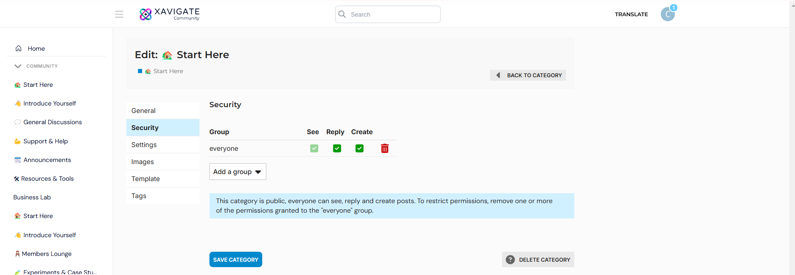
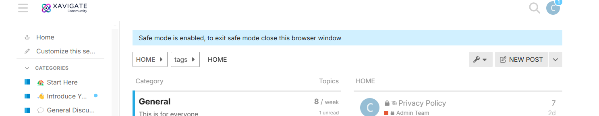
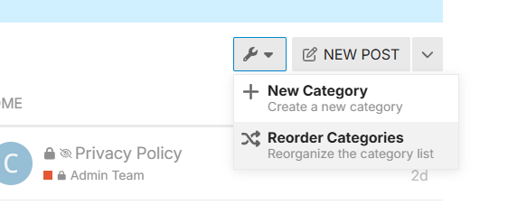

# XAVIGATE Discourse Theme - Client Documentation

Welcome! This document explains, in simple terms, how this Discourse theme works, where the code is located, and how each part contributes to your forum's design and features.

# 🛠 How to Customize Settings in Discourse

Go to your Discourse admin panel.Visit the theme settings page: https://community.example.com/admin/customize/themes/ select the theme . Scroll down to see all the toggle options like "show likes", "card height", etc. Change settings and click Save — changes apply immediately.

# 📝 How to Edit the Code

# 1. Open this theme repository on GitHub
Ask your developer (or you) to make edits to files like mobile, desktop depending on what you want to change.

# 2. Commit changes on GitHub
After editing any file, click Commit changes (green button) on GitHub to save the update.

# 3. Update the theme in Discourse
Go to: https://community.xavigate.com/admin/customize/themes/17 . Click the “Update from Git” button near the top.Discourse will pull the latest version of your theme and apply it instantly.

# Project Structure Overview

# ✅ common/
Shared code that applies to both desktop and mobile views.

# ✅ desktop/
Contains styles, templates, or JS specific to desktop devices.

# ✅ mobile/
Like desktop/, but only for mobile devices.

# ✅ assets/
Used for images, logos, icons, or custom SVGs used in the theme.

# ✅ javascripts/discourse/
Custom JavaScript code that interacts with Discourse components.

# How to setup custom Groups or Spaces

 1. Go to https://community.xavigate.com/g as admin and click on new group
 2. Add the details and add owners and members click create 
 3. To add this group to a category go inside the category and click on wrench icon
  

4. Go to secuirty and add the group created and staff to that group remove all others , to make it private to that group only 

video tutorial for refrence 
[Download Video (MP4)](Spaces%20xavigate.mp4)

# How to create a Category 
1. go to https://community.xavigate.com/categories?safe_mode=no_themes%2Cno_plugins and click on wrench icon 

2. Click on new category and add details 

